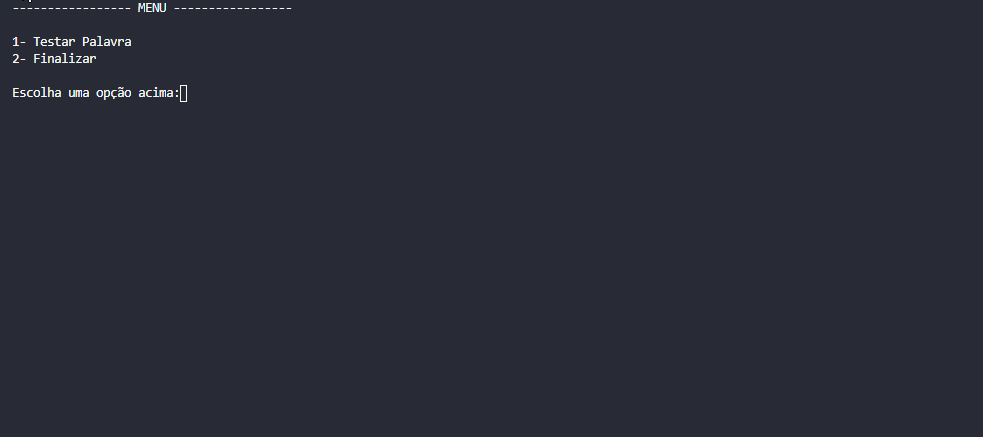

# LFA - Atividade de Implementação 2

## Problema
> O trabalho prático consiste na implementação de um reconhecedor de palavras utilizando o algoritmo CYK. Cada aluno deve pesquisar sobre o algoritmo, fazer uma explicação detalhada de como o algoritmo funciona e apresentar uma implementação do mesmo.

> A implementação deve partir de uma gramática colocada em um arquivo de texto. O programa deve ler esse arquivo de texto e carregar a gramática correspondente. Considere que a gramática já vai ser escrita na forma normal de Chomsky, requisito necessário para o algoritmo CYK. 

## Demo


## Como funciona à aplicação
Antes de rodar à aplicação, é necessário cadastrar uma gramática que será levada em consideração para validar se uma determinada palavra faz parte da gramática proposta, o arquivo fica na pasta raiz do projeto ```LFA-algorithmCYK/grammar.txt```, abaixo podemos ver um exemplo de gramática que foi proposto para o desafio:

```
S => XB | AB
X => AS
A => a
B => b
```

A gramática acima reconhece as palavras no alfabeto {a,b} que fazem parte da linguagem a^nb^n.
